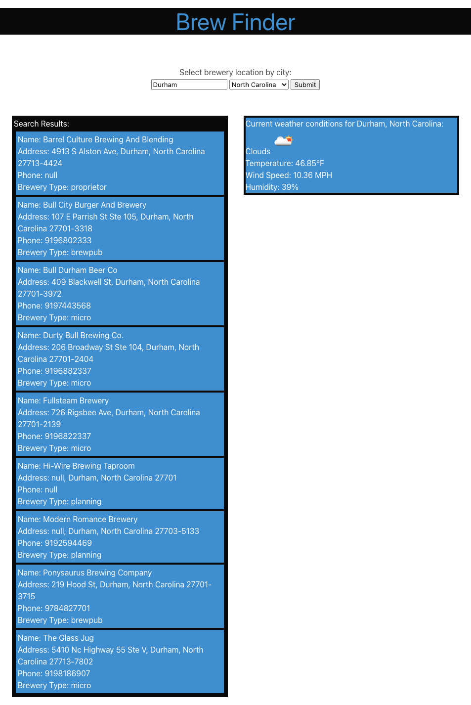

# Brew-Finder-Project-01

## Description

Brew Finder is an application that was designed to help the user find a list of nearby breweries as well as provide current weather information.

## Installation

N/A

## Usage

Open the URL, enter city and state information, and click the submit button to find a list of breweries and current weather conditions for your chosen city.

URL: https://seropyan1995.github.io/Brew-Finder-Project-01/

Screenshot: 

## Credits

### Contributors:

Daniel Bowen - https://github.com/dfbowen77 

Gevork Seropyan - https://github.com/Seropyan1995

Danial Mahmoudi - https://github.com/danialmahmoudi16

Jon Parker - https://github.com/jparker1221

### APIs Used:

Open Brewery DB - https://www.openbrewerydb.org/

OpenWeather - https://openweathermap.org/

## License

MIT License